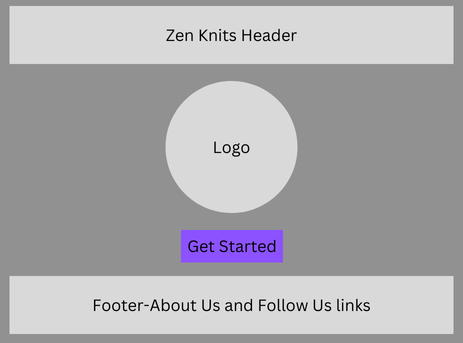
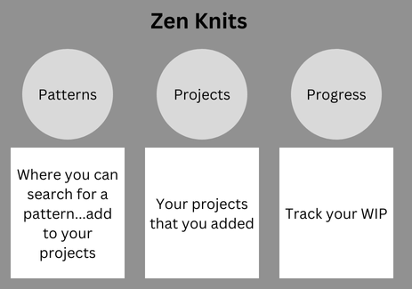

# The-Knitting-App

## Zen Knits

Find your yarn and your zen...

A place where you can find patterns, add patterns to your project's lists, get inspiration and even tutorials. 

## Wireframes

### Splash Page

### Main Page

## Process

The app will be using Ravelry API and a AI model from HuggingFace. The way this API is set up is you can search by a query and get patterns list but, without details that the user will need. So I will have to add a second fetch to search by the user pick's ID. Ravelry's API only provides the details I need when you search by the patterns ID which is included in the pattern list from the query search. So, I will have to loop thru and get the ID that way. 

- Search patterns 
    - Example URL: https://api.ravelry.com/patterns/search.json?query=${query}
    - user picks one
- Get pattern by ID from the user's pick and return pattern details. Such as, gauge, yarn suggestions, yarn weight, needle size, etc.
    - Example URL: https://api.ravelry.com/patterns.json?ids=${ids}
- Save user pick and details to localStorage - to be accessed later in user projects
- Add new projects and track your progress.
- AI integrated with pattern suggestions and step-by-step tutorials. - openAI or HuggingFace 

